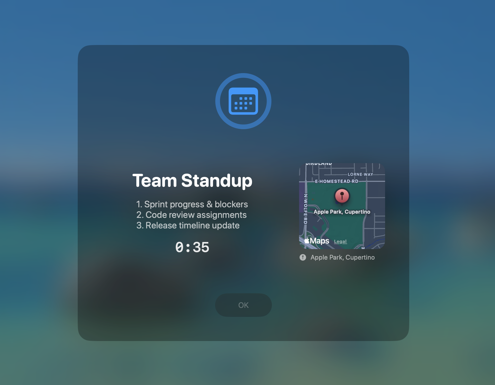

# HeadsUpKit :calendar:

<p align="center">
  
</p>

> Never miss a meeting again. HeadsUpKit lives in your menu bar and displays a fullscreen heads-up overlay with event details and a countdown timer right before your next calendar event starts.

## :rocket: Usage

1. Launch the app — it appears as a calendar icon in the menu bar
2. Select which calendars to monitor from the dropdown
3. Adjust the lead time with the slider (how many seconds before the event)
4. When an event is approaching, a fullscreen overlay appears
5. Press **Escape** or click **OK** to dismiss

## :sparkles: Features

- **Fullscreen overlay** with event title, description, countdown timer, and optional map
- **Menu bar integration** with calendar selection and configurable lead time
- **Automatic event detection** polling every 20 seconds
- **Location support** with inline map via geocoding
- **Native macOS blur** using `NSVisualEffectView` for a polished look

## :computer: Requirements

- macOS 26.2+
- Calendar access permission

## :floppy_disk: Installation

### Homebrew

```bash
brew tap juliankahnert/tap
brew install --cask headsupkit
```

### Download

Download the latest release from [GitHub Releases](https://github.com/JulianKahnert/HeadsUpKit/releases/latest).

### From source

- Download and install [Xcode.app](https://apps.apple.com/app/xcode/id497799835)
- Get the project: `git clone https://github.com/JulianKahnert/HeadsUpKit.git`
- Build and run `HeadsUpKit`

## :octocat: How to contribute

All contributions are welcome!
Feel free to submit pull requests or open issues.
